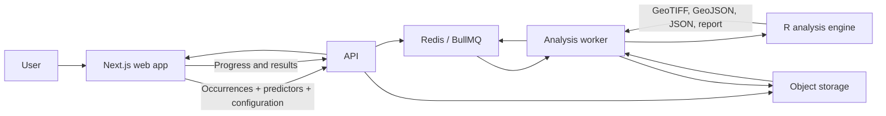
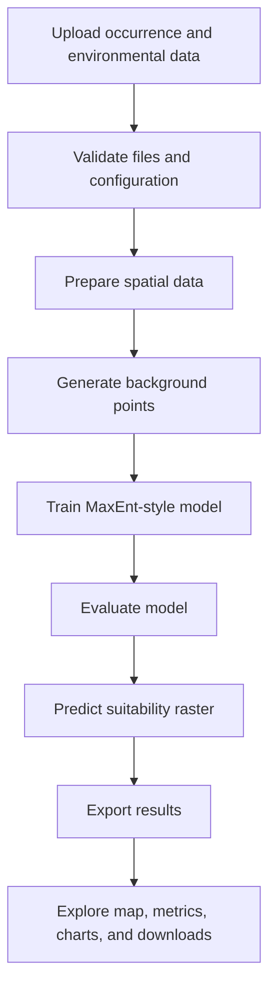
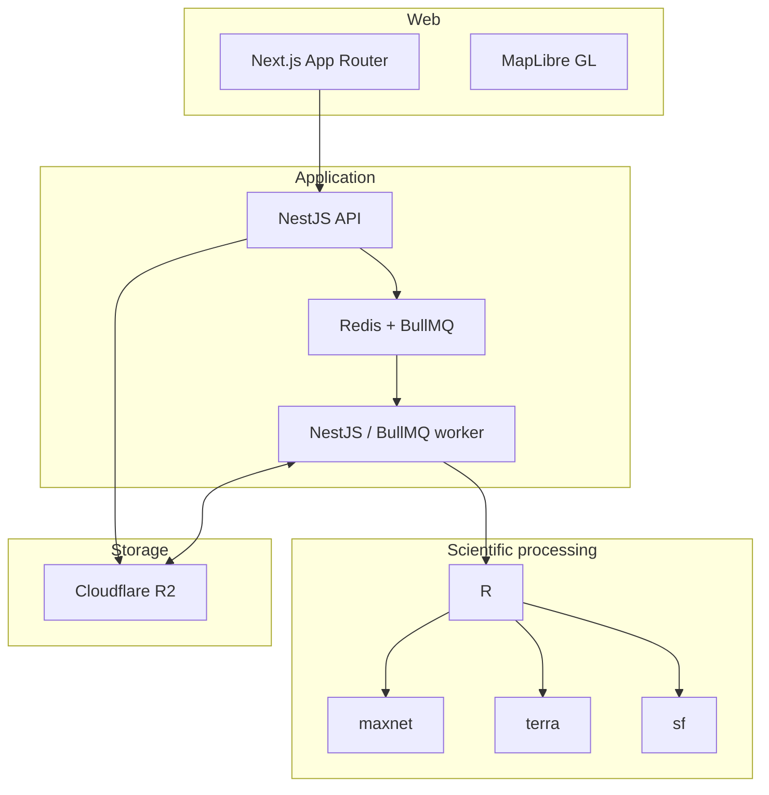
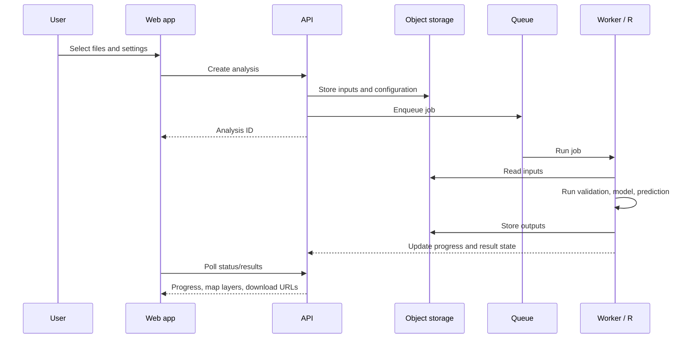

# EcoSuitability

EcoSuitability is a planned web GIS application for modelling environmental and species habitat suitability. A user uploads occurrence records and environmental predictors, configures a MaxEnt-style model, and receives an interactive map, model metrics, response curves, variable importance, and downloadable GIS artifacts.

> The repository currently contains the architecture plan. The application services described below are the intended implementation.

## What It Does

EcoSuitability answers: **where are conditions most suitable for a species, based on known occurrences and environmental data?**

Users provide occurrence data such as species name, latitude, and longitude. They can also provide predictor columns or spatial raster layers, for example temperature, rainfall, elevation, wind, vegetation, or soil. The analysis engine fits a `maxnet` model and predicts suitability across the supplied geographic area.



## How An Analysis Works



The NestJS API creates an analysis ID, stores temporary files in object storage, and queues a background job. A separate NestJS/BullMQ worker creates an isolated workspace and runs R. R reports progress as JSON lines; the worker writes that status to Redis so the web app can show each stage in near real time. Results are retained temporarily, then automatically deleted.

## Outputs

- Interactive MapLibre map with occurrence points and predicted suitability
- Model statistics such as AUC and a suitability threshold
- Variable importance and response curves
- `result.json`, occurrence `GeoJSON`, suitability `GeoTIFF`, response-curve data, and an Excel report

## Architecture



The API and worker are separate processes. For the first deployment, they may share one small machine/container, but the queue and object storage allow workers to scale independently later.

## Technology Stack

| Area | Technology | Purpose |
| --- | --- | --- |
| Web | Next.js, TypeScript | UI, routing, analysis configuration, and progress display |
| Maps and charts | MapLibre GL, Recharts | GIS visualisation and model charts |
| API and worker | NestJS, TypeScript, BullMQ | Upload orchestration, validation, job processing, and result access |
| Temporary state | Redis | Queue backing, job status, progress, and expiry |
| Scientific engine | R, `maxnet`, `terra`, `sf` | Modelling, raster and vector GIS processing |
| Object storage | Cloudflare R2 | Temporary uploaded inputs and generated artifacts |
| Local object storage | MinIO | S3-compatible local replacement for R2 |
| Workspace | pnpm workspaces, Turborepo | Shared packages, cached builds, simpler CI |
| Containers | Docker Compose | Local service orchestration |

## Planned Repository Layout

```text
apps/
  web/              Next.js App Router frontend
  api/              NestJS API
  worker/           NestJS/BullMQ worker and R orchestration
packages/
  contracts/        Shared Zod schemas, DTOs, job states, error codes
  geo-utils/        Browser and Node-safe GIS helpers
  ui/               Optional reusable presentational components
  config/           Shared TypeScript and ESLint configuration
services/
  analysis-r/       R source, renv lockfile, and analysis Docker image
infrastructure/
  docker/           Docker Compose and container configuration
```

`packages/contracts` is the shared API boundary: schemas are defined with Zod, then TypeScript types are inferred from them. The web app uses them for client-side validation and typed requests; the API validates them again at its boundary. Backend-only code, including Redis, R2, queues, filesystem access, and R process execution, stays out of shared packages.

There is **no SQL database** in this architecture. Redis holds temporary queue and job state only; R2/MinIO hold temporary files only. Both are configured with automatic expiry.

## Data Lifecycle



Analysis data is temporary by design. Redis job state and object-storage artifacts use matching retention windows, normally 24-72 hours. Signed URLs provide time-limited access to result files.

## Development And Deployment

Local development will run the web app, API, worker, Redis, and MinIO via Docker Compose. The R image includes R, `maxnet`, `terra`, `sf`, and the required GDAL, PROJ, and GEOS libraries.

Production can begin with the Next.js app hosted separately and one container-capable server running the API, worker, and R environment. Cloudflare R2 stores artifacts; a managed Redis service or self-hosted Redis supplies the queue. Additional workers can be added without redesigning the application.

## Further Detail

See [EcoSuitability-Plan.md](./EcoSuitability-Plan.md) for the full architecture, validation rules, security model, testing approach, and scaling plan.
