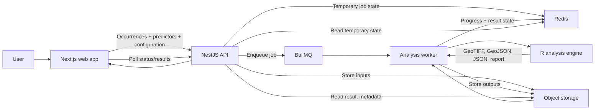
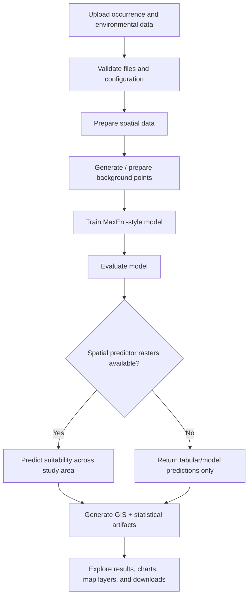
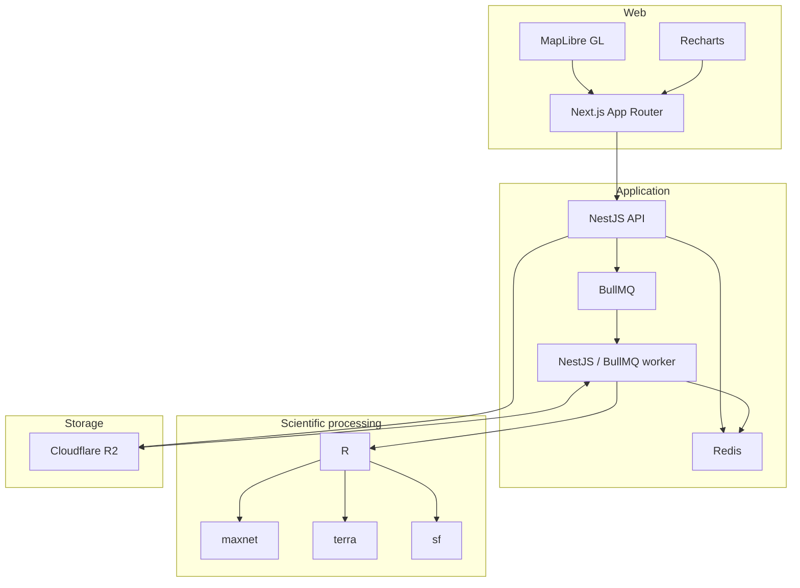
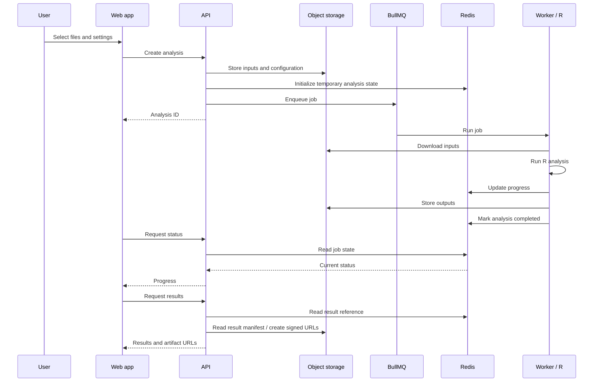

# EcoSuitability

EcoSuitability is a production-ready web GIS application for modelling environmental and species habitat suitability.

A user uploads species occurrence records and environmental predictors, configures a MaxEnt-style model, and receives an interactive GIS map, model metrics, response curves, variable importance, and downloadable scientific/GIS artifacts.

> The repository currently contains the architecture plan. The application services described below are the intended implementation.

## Environment Setup

Each deployable application owns its environment contract. Commit only the
`.env.example` templates; real environment files and deployment secrets must
never enter Git.

```sh
cp apps/web/.env.example apps/web/.env.local
cp apps/api/.env.example apps/api/.env
cp apps/worker/.env.example apps/worker/.env
cp infrastructure/docker/.env.example infrastructure/docker/.env.local
```

- `apps/web/.env.local` contains browser-safe `NEXT_PUBLIC_*` values only.
- `apps/api/.env` and `apps/worker/.env` contain their own runtime configuration.
- `infrastructure/docker/.env.local` supplies Docker Compose values. Use `pnpm docker:up` after creating it.
- Production values belong in the hosting provider's secret manager, separately for each deployed service.

`NEXT_PUBLIC_*` values are embedded when the Next.js image is built. Set the
production public API URL before building; it cannot be changed by a runtime
container environment variable.

## What It Does

EcoSuitability answers:

> **Where are conditions most suitable for a species, based on known occurrences and environmental data?**

Users provide occurrence data such as:

- species
- latitude
- longitude

Environmental predictors may include:

- temperature
- rainfall
- elevation
- wind
- vegetation
- soil
- humidity
- land cover

Predictors can be supplied either as tabular values associated with observations or as spatial raster layers such as GeoTIFFs.

The R analysis engine uses `maxnet` to fit a MaxEnt-style species distribution model.

When environmental raster layers covering the study area are available, the trained model can be projected across that area to generate a continuous habitat-suitability raster.



## How an Analysis Works



The NestJS API creates an analysis ID, stores temporary input files in object storage, creates temporary job state in Redis, and queues a BullMQ job.

A separate worker receives the job, creates an isolated workspace, downloads the required inputs, and executes the R analysis engine.

R reports progress as machine-readable JSON lines. The worker parses those events and writes progress and job state directly to Redis.

The web application polls the NestJS API for status. The API reads the current state from Redis and returns it to the frontend.

When processing finishes, generated artifacts are uploaded to object storage and the Redis job state is marked as completed.

Analysis data is temporary and automatically expires after the configured retention period.

---

## Input Data

### Occurrence Data

Occurrence data can be uploaded as Excel or CSV.

Example:

```text
species | latitude | longitude
--------|----------|----------
Oak     | 45.26    | 19.84
Oak     | 45.27    | 19.82
Oak     | 45.31    | 19.91
```

Depending on the modelling workflow, the dataset may also contain presence/background information and predictor values.

### Environmental Predictors

Predictors can include:

```text
temperature
rainfall
wind
elevation
vegetation
soil
humidity
land_cover
```

They can be supplied in two main ways.

#### Tabular predictors

Example:

```text
species | latitude | longitude | temperature | rainfall | elevation
--------|----------|-----------|-------------|----------|----------
Oak     | 45.26    | 19.84     | 21.4        | 820      | 114
Oak     | 45.27    | 19.82     | 22.1        | 790      | 132
```

These values can be used for model fitting, evaluation, and predictions for supplied observations/samples.

#### Spatial raster predictors

Example:

```text
temperature.tif
rainfall.tif
wind.tif
elevation.tif
vegetation.tif
```

These describe environmental conditions across an entire geographic area.

Spatial predictor rasters are required when the application needs to generate a continuous suitability map across the study area.

In simplified terms:

```text
Occurrence points
       +
Environmental rasters
       ↓
MaxEnt model
       ↓
Suitability prediction for every raster cell
       ↓
suitability.tif
```

The application must not imply that a continuous geographic suitability raster can be generated from occurrence coordinates and observation-level predictor values alone.

---

## Outputs

Depending on the supplied inputs and analysis configuration, a completed analysis can provide:

### Interactive GIS outputs

- habitat suitability layer
- species occurrence points
- environmental predictor layers
- background points
- thresholded suitable-habitat areas
- interactive map inspection

### Model outputs

- AUC and other evaluation metrics
- suitability threshold
- variable importance
- variable contribution
- response curves
- model configuration and warnings

### Downloadable artifacts

- `result.json`
- occurrence `GeoJSON`
- suitability `GeoTIFF`
- response-curve data
- model/evaluation data
- Excel analysis report

GIS artifacts that depend on spatial raster prediction are generated only when the required spatial predictor data is available.

---

## Architecture



The API and worker are separate application processes.

For the initial single-user deployment, they may run on the same small machine/container while remaining logically separated in the codebase.

The queue and object-storage boundaries allow the worker to be moved to dedicated compute or horizontally scaled later without redesigning the analysis pipeline.

---

## Technology Stack

| Area               | Technology                 | Purpose                                                            |
| ------------------ | -------------------------- | ------------------------------------------------------------------ |
| Web                | Next.js, TypeScript        | UI, routing, uploads, analysis configuration, progress and results |
| Maps               | MapLibre GL                | Interactive GIS visualization                                      |
| Charts             | Recharts                   | Metrics, variable importance and response curves                   |
| API                | NestJS, TypeScript         | Upload orchestration, validation, status and result access         |
| Worker             | NestJS, TypeScript, BullMQ | Background analysis execution and R orchestration                  |
| Queue              | BullMQ                     | Asynchronous analysis jobs                                         |
| Temporary state    | Redis                      | Queue backing, job status, progress and expiry                     |
| Scientific engine  | R, `maxnet`                | MaxEnt-style modelling                                             |
| Raster GIS         | `terra`                    | Raster loading, validation, extraction and prediction              |
| Vector GIS         | `sf`                       | Occurrence points, vectors, CRS operations and GeoJSON             |
| Production storage | Cloudflare R2              | Temporary uploaded inputs and generated artifacts                  |
| Local storage      | MinIO                      | S3-compatible local replacement for R2                             |
| R dependencies     | `renv`                     | Reproducible R package environment                                 |
| Workspace          | pnpm workspaces, Turborepo | Shared packages, cached builds and CI                              |
| Containers         | Docker / Docker Compose    | Reproducible local and production environments                     |

There is **no SQL database** in the architecture.

Redis contains temporary runtime/job state only.

R2/MinIO contains temporary analysis files only.

---

## Planned Repository Layout

```text
apps/

  web/
    Next.js App Router frontend

  api/
    NestJS API

  worker/
    NestJS/BullMQ analysis worker

packages/

  contracts/
    Shared Zod schemas
    API request/response contracts
    analysis configuration
    job states
    error codes
    result manifests

  geo-utils/
    Browser-safe and Node-safe GIS helpers

  ui/
    Optional reusable presentational components

  config/
    Shared TypeScript, ESLint and workspace configuration

services/

  analysis-r/
    R source
    renv.lock
    analysis tests
    analysis Docker image

infrastructure/

  docker/
    Dockerfiles
    Docker Compose
    local Redis/MinIO configuration

tests/
    Integration and end-to-end fixtures

docs/
    Detailed architecture and scientific documentation
```

`packages/contracts` is the shared application boundary.

Schemas are defined with Zod and TypeScript types are inferred from those schemas.

The web application uses them for client-side validation and typed API communication.

The NestJS API validates the same contracts again at its trust boundary.

Backend-specific functionality stays outside shared packages, including:

- Redis access
- BullMQ
- R2 access
- filesystem operations
- R process execution
- worker infrastructure

---

## R Analysis Engine

The R code is the scientific calculation layer.

A planned structure is:

```text
services/analysis-r/

  main.R

  ingestion/
    read-input.R
    validate-input.R

  preprocessing/
    prepare-data.R
    spatial-validation.R
    background-points.R

  models/
    maxnet-model.R

  evaluation/
    auc.R
    thresholds.R
    variable-importance.R
    response-curves.R

  spatial/
    extract-environment.R
    raster-prediction.R
    suitability-map.R

  export/
    export-json.R
    export-geojson.R
    export-geotiff.R
    export-report.R

  tests/

  renv.lock
```

The worker executes only the R entry point:

```bash
Rscript main.R \
  --input /work/an_abc123/input \
  --config /work/an_abc123/config.json \
  --output /work/an_abc123/output
```

`main.R` orchestrates the internal scientific pipeline:

```text
read inputs
     ↓
validate data
     ↓
prepare spatial/environmental data
     ↓
prepare background data
     ↓
train maxnet model
     ↓
evaluate model
     ↓
predict suitability
     ↓
generate GIS/statistical outputs
     ↓
export result manifest
```

The NestJS API does not implement or need to understand the underlying scientific calculations.

---

## Progress Reporting

R writes structured JSON lines to stdout during execution.

Example:

```json
{"stage":"validation","progress":10}
{"stage":"preprocessing","progress":25}
{"stage":"training","progress":45}
{"stage":"evaluation","progress":60}
{"stage":"prediction","progress":80}
{"stage":"export","progress":95}
```

The worker reads these events and updates Redis.

The frontend requests status through the API:

```http
GET /analyses/an_abc123/status
```

The API reads Redis and responds:

```json
{
  "analysisId": "an_abc123",
  "status": "running",
  "stage": "training",
  "progress": 45
}
```

Possible states include:

```text
queued
validating
preprocessing
training
evaluating
predicting
exporting
completed
failed
cancelled
```

---

## Result Manifest

Every successful analysis produces a machine-readable `result.json`.

Example:

```json
{
  "model": {
    "type": "maxnet",
    "auc": 0.89,
    "threshold": 0.54
  },

  "variables": [
    {
      "name": "temperature",
      "importance": 42
    },
    {
      "name": "rainfall",
      "importance": 31
    },
    {
      "name": "elevation",
      "importance": 18
    }
  ],

  "artifacts": {
    "occurrences": "occurrences.geojson",
    "suitability": "suitability.tif",
    "responseCurves": "response-curves.json",
    "report": "analysis-report.xlsx"
  }
}
```

The worker uploads the manifest and generated artifacts to object storage.

Redis then stores the temporary reference to the completed result.

---

## Data Lifecycle



The worker **does not report progress through the API**.

It updates Redis directly.

The API acts as the controlled interface through which the frontend reads that state.

---

## Temporary Storage

Analysis data is temporary by design.

Example object layout:

```text
analyses/an_abc123/

  input/
    occurrences.xlsx
    temperature.tif
    rainfall.tif
    elevation.tif

  config/
    analysis.json

  output/
    result.json
    suitability.tif
    occurrences.geojson
    variable-importance.json
    response-curves.json
    analysis-report.xlsx
```

Typical lifecycle:

```text
analysis created
      ↓
inputs stored
      ↓
analysis executed
      ↓
results available
      ↓
24–72 hour retention
      ↓
Redis state expires
      +
R2 objects automatically deleted
```

Redis TTLs and R2 lifecycle policies should use matching retention windows.

Signed URLs provide time-limited access to downloadable artifacts.

---

## Local Development

Local development uses Docker Compose.

```text
Next.js
   │
   ▼
NestJS API
   │
   ├──── Redis
   │
   ├──── BullMQ
   │
   └──── MinIO
             │
             ▼
          Worker
             │
             ▼
             R
       ┌─────┼─────┐
     maxnet terra   sf
```

Expected services:

```text
web
api
worker
redis
minio
```

MinIO provides an S3-compatible API locally while Cloudflare R2 provides the same storage role in production.

The R worker image includes:

- R
- `maxnet`
- `terra`
- `sf`
- GDAL
- PROJ
- GEOS
- required R/system dependencies
- `renv` dependency lock

This provides a reproducible scientific runtime across development, CI, and production.

---

## Initial Production Deployment

The application is initially intended as a helper for a single user while keeping the codebase production-ready.

A suitable first deployment is:

```text
              Next.js
                 │
                 ▼
       Small compute instance
       ┌───────────────────┐
       │ NestJS API        │
       │ BullMQ Worker     │
       │ R runtime         │
       │ maxnet/terra/sf   │
       └─────────┬─────────┘
                 │
        ┌────────┴────────┐
        ▼                 ▼
      Redis         Cloudflare R2
```

The API and worker remain separate processes even when hosted on the same machine.

Initial worker concurrency can be:

```text
1
```

This matches the expected single-user workload and prevents multiple GIS analyses from competing for memory.

---

## Scaling

The application boundaries allow compute to scale without redesigning the scientific workflow.

Initial:

```text
API + Worker + R
one machine
one active analysis
```

Later:

```text
API
 │
 ▼
Redis / BullMQ
 │
 ├── Worker 1 + R
 ├── Worker 2 + R
 └── Worker 3 + R

All workers
     │
     ▼
Cloudflare R2
```

Because job communication already happens through BullMQ and files already live in object storage, workers can be moved to independent machines or containers without changing the API/R contract.

---

## Security

Uploaded files are untrusted input.

The application should enforce:

- allowed file formats
- file-size limits
- MIME/type validation
- upload-count limits
- archive extraction limits
- path traversal protection
- worker execution timeouts
- memory/CPU limits
- isolated per-analysis workspaces
- rate limiting
- signed result URLs

The R pipeline must never execute user-provided R code or shell commands.

Users provide only data and validated analysis configuration.

---

## Testing

### Web

Test:

- uploads
- configuration
- progress states
- errors and warnings
- MapLibre layers
- charts
- result downloads

### API

Test:

- request validation
- uploads
- Redis integration
- BullMQ integration
- R2 integration
- status endpoints
- signed URLs
- cancellation
- error mapping

### Worker

Test:

- job processing
- isolated workspaces
- R execution
- progress parsing
- timeouts
- output validation
- cleanup
- failed-job handling

### R

Test:

- input parsing
- coordinate validation
- raster validation
- preprocessing
- background generation
- model fitting
- predictions
- evaluation metrics
- result exports

Fixed scientific fixture datasets should be used for regression testing so dependency or implementation changes do not silently alter expected model behaviour.

---

## Full End-to-End Flow

```text
1. User uploads occurrence/environmental data

2. User configures the analysis

3. Web sends POST /analyses

4. API:
   - validates request
   - generates analysis ID
   - stores inputs in R2
   - stores configuration
   - initializes Redis state
   - enqueues BullMQ job

5. Web receives analysis ID

6. Worker receives the job

7. Worker:
   - creates isolated workspace
   - downloads inputs
   - launches R

8. R:
   - validates scientific data
   - prepares environmental data
   - prepares background points
   - trains maxnet
   - evaluates model
   - predicts suitability
   - generates GIS/statistical artifacts

9. R reports progress through stdout

10. Worker updates Redis

11. Worker uploads generated artifacts to R2

12. Worker marks the analysis completed in Redis

13. Web polls the API

14. API reads Redis and reports completion

15. Web requests results

16. API returns:
    - model metrics
    - chart data
    - GIS layer information
    - signed artifact URLs

17. User explores:
    - suitability map
    - occurrence points
    - environmental layers
    - AUC/metrics
    - variable importance
    - response curves

18. User downloads desired artifacts

19. After the retention period:
    - Redis state expires
    - R2 objects are deleted
```

---

## Responsibility Boundaries

```text
Next.js
→ user experience

MapLibre
→ interactive GIS visualization

Recharts
→ statistical visualization

NestJS API
→ validation, orchestration and controlled access

Redis
→ temporary analysis state

BullMQ
→ asynchronous job delivery

Cloudflare R2 / MinIO
→ temporary scientific file storage

Analysis Worker
→ isolated execution and R orchestration

R
→ scientific processing

maxnet
→ MaxEnt-style modelling

terra
→ raster GIS processing

sf
→ vector GIS processing
```

There is **no SQL database** in this architecture.

The system is designed around temporary analyses and temporary artifacts rather than persistent projects or analysis history.

## Further Detail

See `EcoSuitability-Plan.md` for the complete implementation plan, scientific contracts, validation rules, security model, testing strategy, and deployment details.
